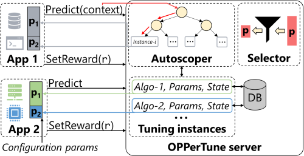

<div style="text-align: center;">



[License](https://github.com/microsoft/OPPerTune/blob/main/LICENSE) |
[Security](https://github.com/microsoft/OPPerTune/blob/main/SECURITY.md) |
[Support](https://github.com/microsoft/OPPerTune/blob/main/SUPPORT.md) |
[Code of Conduct](https://github.com/microsoft/OPPerTune/blob/main/CODE_OF_CONDUCT.md)
</div>

# OPPerTune

OPPerTune is a framework that enables configuration tuning of applications, including those in live deployment. It reduces application interruptions while maximizing the performance of the application as and when the workload or the underlying infrastructure changes. It automates three essential processes that facilitate post-deployment configuration tuning:

1. Determining which configurations to tune
1. Automatically managing the scope at which to tune the configurations (using AutoScope)
1. Using a novel reinforcement learning algorithm to simultaneously and quickly tune numerical and categorical configurations, thereby keeping the overhead of configuration tuning low.

## Installation

### Prerequisites

- Python 3 (>= 3.7)

1. Install the latest version of `pip` and `setuptools`

    ```bash
    python3 -m pip install --upgrade pip setuptools
    ```

1. To setup the package locally, run

    ```bash
    cd src
    python3 -m pip install .
    ```

## Tour of the OPPerTune package

### 1. Defining the parameters to be tuned

We define the parameters of the system to be tuned. To specify a parameter, you need to provide the following:

#### Numerical parameters

- `name`: The name of the parameter.

- `initial_value`: The initial value of the parameter.

- `lb`: The lower bound value that the parameter can take.

- `ub`: The upper bound value that the parameter can take.

- `step_size` (optional): The minimum amount by which a parameter's value can be perturbed. In the example below, the values for `p2` are restricted to `(100, 200, 300, ... 900)` because we have specified a `step_size` of `100`. For `ContinuousValue`, the default `step_size` is `None`, which indicates any arbitrary amount of perturbation, whereas for `DiscreteValue`, the default (and also the minimum) value for `step_size` is `1`.

#### Categorical parameters

- `name`: The name of the parameter

- `initial_value`: The initial value of the parameter

- `categories`: The list of allowed values (atleast 2)

```python
from oppertune import CategoricalValue, ContinuousValue, DiscreteValue

parameters = [
    ContinuousValue(
        name="p1",
        initial_value=0.45,
        lb=0.0,
        ub=1.0,
    ),
    DiscreteValue(
        name="p2",
        initial_value=100
        lb=100,
        ub=900,
        step_size=100,
    ),
    CategoricalValue(
        name="p3",
        initial_value="medium",
        categories=["low", "medium", "high"]
    )
]
```

### 2. Choosing the algorithm

```python
algorithm = "hybrid_solver"  # Supports continuous, discrete and categorical parameters

algorithm_args = dict(
    numerical_solver="bluefin",  # For the numerical (continuous and discrete) parameters
    numerical_solver_args=dict(
        feedback=2,
        eta=0.01,
        delta=0.1,
        random_seed=123,  # Just for reproducibility
    ),
    categorical_solver="exponential_weights_slates",  # For the categorical parameters
    categorical_solver_args=dict(
        random_seed=123,  # Just for reproducibility
    ),
)
```

### 3. Creating an instance of OPPerTune

```python
from oppertune import OPPerTune

tuner = OPPerTune(parameters, algorithm, algorithm_args)
```

### 4. Configuring the app to use OPPerTune's predictions

#### Before

```python
app.set_config(...)
```

#### After

```python
prediction, metadata = tuner.predict()
app.set_config(prediction)

# prediction will be a dictionary, with the keys as the names of the parameters
# and the values as the ones predicted by OPPerTune.
# E.g., {"p1": 0.236, "p2": 300, "p3": "medium"}

# metadata is any additional (possibly None) data required by the algorithm.
# This should always be passed back in the set_reward call.
```

### 5. Reward formulation

OPPerTune uses a reward to compute an update to the parameter values. This reward needs to be a function of the metrics (e.g., throughput, latency) of the current state of the system.

```python
def calculate_reward(metrics) -> float:
    """
    We assume that the metrics of concern for us are latency and throughput.
    There can be more (or less) metrics that you may want to optimize for as well.
    """
    latency = metrics["latency"]
    throughput = metrics["throughput"]

    # Higher the throughput, higher the reward
    # Lower the latency, higher the reward
    reward = throughput / latency

    # (Optional) You can scale the reward to [0, 1]
    # reward = sigmoid(reward)
    return reward
```

### 6. Sending the reward back to OPPerTune for its prediction

```python
tuner.set_reward(reward, metatadata)
```

### 7. Putting together all the pieces in a tuning loop

```python
from oppertune import CategoricalValue, ContinuousValue, DiscreteValue, OPPerTune

def calculate_reward(metrics):
    latency = metrics["latency"]
    throughput = metrics["throughput"]

    # Higher the throughput, higher the reward
    # Lower the latency, higher the reward
    reward = throughput / latency

    # (Optional) You can scale the reward to [0, 1]
    # reward = sigmoid(reward)
    return reward


def main():
    parameters = [
        ContinuousValue(
            name="p1",
            initial_value=0.45,
            lb=0.0,
            ub=1.0,
        ),
        DiscreteValue(
            name="p2",
            initial_value=100
            lb=100,
            ub=900,
            step_size=100,
        ),
        CategoricalValue(
            name="p3",
            initial_value="medium",
            categories=["low", "medium", "high"]
        )
    ]
    
    algorithm="hybrid_solver"  # Supports continuous, discrete and categorical parameters

    algorithm_args=dict(
        numerical_solver="bluefin",  # For the numerical (continuous and discrete) parameters
        numerical_solver_args=dict(
            feedback=2,
            eta=0.01,
            delta=0.1,
            random_seed=123,  # Just for reproducibility
        ),
        categorical_solver="exponential_weights_slates",  # For the categorical parameters
        categorical_solver_args=dict(
            random_seed=123,  # Just for reproducibility
        ),
    )

    while True:
        prediction, metadata = tuner.predict()

        metrics_monitor.start()  # To monitor the metrics of concern

        app.set_config(prediction)
        app.deploy()  # Using the new parameter values

        metrics = metrics_monitor.stop()
        reward = calculate_reward(metrics)
        tuner.set_reward(reward, metatadata)

        # Optionally, you can stop once the metrics are good enough
        # which is indicated by a high reward
        if reward >= 0.95:   # Assuming the reward is between [0, 1]
            break


if __name__ == "__main__":
    main()
```

For a working example, refer to [examples/hybrid_solver/main.py](examples/hybrid_solver/main.py)

## Contributing

This project welcomes contributions and suggestions.  Most contributions require you to agree to a
Contributor License Agreement (CLA) declaring that you have the right to, and actually do, grant us
the rights to use your contribution. For details, visit https://cla.opensource.microsoft.com.

When you submit a pull request, a CLA bot will automatically determine whether you need to provide
a CLA and decorate the PR appropriately (e.g., status check, comment). Simply follow the instructions
provided by the bot. You will only need to do this once across all repos using our CLA.

This project has adopted the [Microsoft Open Source Code of Conduct](https://opensource.microsoft.com/codeofconduct/).
For more information see the [Code of Conduct FAQ](https://opensource.microsoft.com/codeofconduct/faq/) or
contact [opencode@microsoft.com](mailto:opencode@microsoft.com) with any additional questions or comments.

### Setup

```bash
pip install -e "./[dev]"
```

### Style guide

To ensure your code follows the style guidelines, install `black>=23.1` and `isort>=5.11`

```shell
pip install black>=23.1
pip install isort>=5.11
```

then run,

```shell
isort . --sp=pyproject.toml
black . --config=pyproject.toml
```

## Trademarks

This project may contain trademarks or logos for projects, products, or services. Authorized use of Microsoft
trademarks or logos is subject to and must follow
[Microsoft's Trademark & Brand Guidelines](https://www.microsoft.com/en-us/legal/intellectualproperty/trademarks/usage/general).
Use of Microsoft trademarks or logos in modified versions of this project must not cause confusion or imply Microsoft sponsorship.
Any use of third-party trademarks or logos are subject to those third-party's policies.
