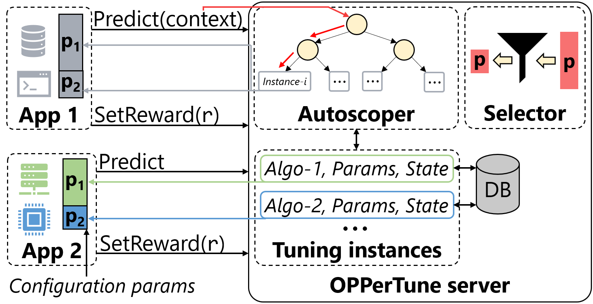

# OPPerTune

<div align="center">



[License](https://github.com/microsoft/OPPerTune/blob/main/LICENSE) |
[Security](https://github.com/microsoft/OPPerTune/blob/main/SECURITY.md) |
[Support](https://github.com/microsoft/OPPerTune/blob/main/SUPPORT.md) |
[Code of Conduct](https://github.com/microsoft/OPPerTune/blob/main/CODE_OF_CONDUCT.md)

</div>

## About

OPPerTune is a framework that enables configuration tuning of applications, including those in live deployment. It reduces application interruptions while maximizing the performance of the application as and when the workload or the underlying infrastructure changes. It automates three essential processes that facilitate post-deployment configuration tuning:

1. Determining which configurations to tune
1. Automatically managing the scope at which to tune the configurations (using AutoScope)
1. Using a novel reinforcement learning algorithm to simultaneously and quickly tune numerical and categorical configurations, thereby keeping the overhead of configuration tuning low.

### Links

- Project page: [https://aka.ms/OPPerTune](https://aka.ms/OPPerTune)

### Papers

1. [OPPerTune: Post-Deployment Configuration Tuning of Services Made Easy](https://www.microsoft.com/en-us/research/publication/oppertune/) _([NSDI 2024](https://www.usenix.org/conference/nsdi24))_

1. [SelfTune: Tuning Cluster Managers](https://www.microsoft.com/en-us/research/publication/selftune-tuning-cluster-managers/) _([NSDI 2023](https://www.usenix.org/conference/nsdi23))_

## Installation

### Prerequisites

- Python 3 (>= 3.8)

1. Install the latest version of `pip`, `setuptools` and `wheel`.

    ```bash
    python -m pip install --upgrade pip setuptools wheel
    ```

1. Install the `oppertune-core` package from the `oppertune-core` folder.

1. To setup the package locally, run

    ```bash
    cd oppertune-algorithms
    pip install .
    ```

## Tour of the OPPerTune package

### 1. Defining the parameters to be tuned

We define the parameters of the system to be tuned. To specify a parameter, you need to provide the following:

#### Numerical parameters

- `name`: The name of the parameter.

- `val`: The initial value of the parameter.

- `min`: The minimum value that the parameter can take.

- `max`: The maximum value that the parameter can take.

- `step` (optional): The minimum amount by which a parameter's value can be perturbed. In the example below, the values for `p2` are restricted to `(100, 200, 300, ... 900)` because we have specified a `step` of `100`. For `Real`, the default `step` is `None`, which indicates any arbitrary amount of perturbation, whereas for `Integer`, the default (and also the minimum) value for `step` is `1`.

#### Categorical parameters

- `name`: The name of the parameter

- `val`: The initial value of the parameter

- `categories`: The list of allowed values (at least 2)

```python
from oppertune.core.values import Categorical, Integer, Real

parameters = [
    Categorical(name="p1", val="medium", categories=("low", "medium", "high")),
    Integer(name="p2", val=100, min=100, max=900, step=100),
    Real(name="p3", val=0.45, min=0.0, max=1.0),
]
```

### 2. Creating an instance of OPPerTune

```python
from oppertune.algorithms.hybrid_solver import HybridSolver

# We are using the HybridSolver algorithm for this example.
# It supports categorical, integer and real parameters

tuning_instance = HybridSolver(
    parameters,
    categorical_algorithm="exponential_weights_slates",  # For the categorical parameters
    categorical_algorithm_args=dict(
        random_seed=123,  # For reproducibility
    ),
    numerical_algorithm="bluefin",  # For the numerical (integer and real) parameters
    numerical_algorithm_args=dict(
        feedback=2,
        eta=0.01,
        delta=0.1,
        random_seed=123,  # For reproducibility
    ),
)
```

### 3. Configuring the app to use OPPerTune's predictions

#### Before

```python
app.set_config(...)
```

#### After

```python
prediction, request_id = tuning_instance.predict()
app.set_config(prediction)

# prediction will be a dictionary, with the keys as the names of the parameters
# and the values as the ones predicted by OPPerTune.
# E.g., {"p1": 0.236, "p2": 300, "p3": "medium"}

# request_id is a unique ID generated for each prediction.
# It should be used for providing reward for the prediction via the `store_reward` API.
```

### 4. Reward formulation

OPPerTune uses a reward to compute an update to the parameter values. This reward needs to be a function of the metrics (e.g., throughput, latency) of the current state of the system.

```python
def calculate_reward(metrics) -> float:
    """
    We assume that the metrics of concern for us are latency and throughput.
    There can be more (or less) metrics that you may want to optimize for as well.
    """

    # Higher the throughput, higher the reward.
    # Lower the latency, higher the reward.
    reward: float = metrics.throughput / metrics.latency

    # (Optional) You should scale the reward to [0, 1].
    # One way would be linearly scale down the reward
    # by dividing it by the max achievable reward.
    # You can normalize your reward in other ways as well.

    # Lets say the best achievable throughput is 1000 requests/second
    # and the best latency is 5 ms
    max_possible_reward: float = 1000 / 5

    reward /= max_possible_reward  # reward now in [0, 1]
    return reward
```

### 5. Reconfigure and deploy

Start observing the metrics and deploy the app.

```python
metrics_monitor.start()  # To start monitoring the metrics of concern
app.deploy()  # Using the new parameter values. Wait till the app finishes the job.
metrics = metrics_monitor.stop()
```

### 6. Calculate the reward

```python
reward: float = calculate_reward(metrics)
```

### 7. Store the reward for the corresponding request ID

```python
tuning_instance.store_reward(request_id, reward)
```

This is useful in scenarios where you wish to call `predict` multiple times before calling `set_reward`.
By storing the reward, you can access the list of tuning requests and the stored reward using `get_tuning_requests`, aggregate the reward and finally call `set_reward`.

### 8. Sending the (aggregated) reward back to OPPerTune for its prediction

```python
tuning_instance.set_reward(reward)
```

### 9. Putting together all the pieces in a tuning loop

```python
from oppertune.algorithms.hybrid_solver import HybridSolver
from oppertune.core.values import Categorical, Integer, Real


def calculate_reward(metrics):
    latency = metrics["latency"]
    throughput = metrics["throughput"]

    # Higher the throughput, higher the reward
    # Lower the latency, higher the reward
    reward = throughput / latency

    # (Optional) You can scale the reward to [0, 1]
    # reward = sigmoid(reward)
    return reward


def main():
    parameters = [
        Categorical(name="p1", val="medium", categories=("low", "medium", "high")),
        Integer(name="p2", val=100, min=100, max=900, step=100),
        Real(name="p3", val=0.45, min=0.0, max=1.0),
    ]
    
    tuning_instance = HybridSolver(
        parameters,
        categorical_algorithm="exponential_weights_slates",  # For the categorical parameters
        categorical_algorithm_args=dict(
            random_seed=123,  # For reproducibility
        ),
        numerical_algorithm="bluefin",  # For the numerical (integer and real) parameters
        numerical_algorithm_args=dict(
            feedback=2,
            eta=0.01,
            delta=0.1,
            random_seed=123,  # For reproducibility
        ),
    )

    while True:
        prediction, request_id = tuning_instance.predict()
        app.set_config(prediction)

        metrics_monitor.start()  # To start monitoring the metrics of concern
        app.deploy()  # Using the new parameter values. Wait till the app finishes the job.
        metrics = metrics_monitor.stop()

        reward = calculate_reward(metrics)

        tuning_instance.store_reward(request_id, reward)

        tuning_instance.set_reward(reward)

        # Optionally, you can stop once the metrics are good enough
        # which is indicated by a high reward
        if reward >= 0.95:   # Assuming the reward lies in [0, 1]
            break


if __name__ == "__main__":
    main()
```

For a working example, refer to [oppertune-algorithms/examples/hybrid_solver/main.py](oppertune-algorithms/examples/hybrid_solver/main.py).

## Contributing

This project welcomes contributions and suggestions.  Most contributions require you to agree to a
Contributor License Agreement (CLA) declaring that you have the right to, and actually do, grant us
the rights to use your contribution. For details, visit https://cla.opensource.microsoft.com.

When you submit a pull request, a CLA bot will automatically determine whether you need to provide
a CLA and decorate the PR appropriately (e.g., status check, comment). Simply follow the instructions
provided by the bot. You will only need to do this once across all repos using our CLA.

This project has adopted the [Microsoft Open Source Code of Conduct](https://opensource.microsoft.com/codeofconduct/).
For more information see the [Code of Conduct FAQ](https://opensource.microsoft.com/codeofconduct/faq/) or
contact [opencode@microsoft.com](mailto:opencode@microsoft.com) with any additional questions or comments.

### Setup

```bash
pip install -e ".[dev]"
```

### Style guide

To ensure your code follows the style guidelines, install `ruff`

```shell
pip install ruff --upgrade
```

then run,

```shell
ruff check
ruff format
```

and make sure that all warnings are addressed.

## Trademarks

This project may contain trademarks or logos for projects, products, or services. Authorized use of Microsoft
trademarks or logos is subject to and must follow
[Microsoft's Trademark & Brand Guidelines](https://www.microsoft.com/en-us/legal/intellectualproperty/trademarks/usage/general).
Use of Microsoft trademarks or logos in modified versions of this project must not cause confusion or imply Microsoft sponsorship.
Any use of third-party trademarks or logos are subject to those third-party's policies.
